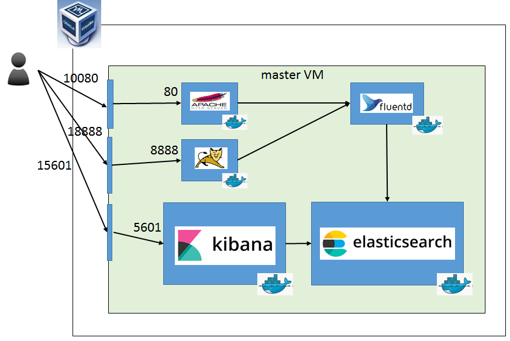

# vagrant_elk

## Description

elk stack環境を1台のVMに自動構築します。

## Requirement

| Package         | Version  |Language| Description |
| --------------- | -------- | ------ | ----------- |
| Vagrant         | 1.8.5    | -      | LOCAL PCに起動させる場合に使用 |
| VirtualBox      | 5.1      | -      | LOCAL PCに起動させる場合に使用 |
| Cygwin          | 任意     | -     |  (Windowsの場合)LOCAL PCに起動させる場合に使用 |

それ以上のVersionでも動くかもしれませんが動作するか不明  
仮想サーバを　Vagrant + VirtualBox　で構築するため、hostマシンには 4GBのメモリが必要です  

## Install

```
$ http_proxy="your proxy settings"
$ https_proxy="your proxy settings"
$ vagrant up
```

以下の仮想サーバを自動構築します。

| ホスト名 | OS | 用途 | 備考 |
|---|---|---|---|
| master | ubuntu 17.04 | 構築用サーバ |  |



## Installed software

| Software   | version | 備考 |
|---|---|---|
| docker | 17.09 | docker-ce |
| docker-compose | 1.17.0 | - |
| elasticsearch | 6.1.1 | dockerコンテナでinstall |
| kibana | 6.1.1 | dockerコンテナでinstall |
| fluentd | v0.12 | dockerコンテナでinstall |

## Usage

以下にVM内に構築しているhttpdのログをfluentdで収集し  
それをkibanaで表示するまでの手順を記載します。  


* curlで以下にアクセスしapacheのログを出力させます  

```
$ unset http_proxy https_proxy
$ CMD="curl -sS -X GET http://127.0.0.1:10080"
$ for i in {0..10}; do $CMD $1; done;
<html><body><h1>It works!</h1></body></html>
<html><body><h1>It works!</h1></body></html>
:
<html><body><h1>It works!</h1></body></html>

$ curl -X GET http://127.0.0.1:18888/rest_sample/test/hello                                                  
hello resource !!

```

* [Kibana](http://127.0.0.1:15601)にアクセスします  

* loginはelastic/changeme　となります  


* ① index patternを作成します(パターン名は`fluentd-*`)  
* ② Time Filter field nameは`@timestamp`を指定します  
* ③ Createを押下します


* Discovery を閲覧しグラフが表示されていることを確認します  


----- 以上 -----
