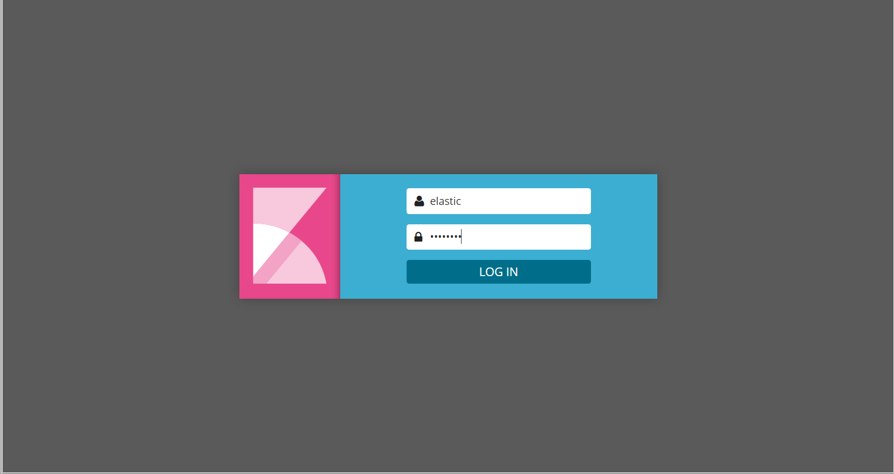

# Alerting demo


## Usage

* 以下を`vagrant up`で作成したVM内で実行します
   ```
   sudo su -
   cd /vagrant/tools/elk
   docker-compose stop && docker-compose rm -f
   ```

* configファイルを修正します
   ```
   vi config
   export USER=elastic

   :

   ## Elastic Xpack Alerting settings
   export IS_EMAIL_ACTION="True"
   export EXCHANGE_MAIL_FROM="<please input>"
   export EXCHANGE_MAIL_USER="<please input>"
   export EXCHANGE_MAIL_PASSWORD="<please input>"
   ```

* elasticsearchを起動します
   ```
   source config && bash setup.sh
   ```

   * 200のアクセスを発生させます
   ```
   CMD="curl -sS -X GET http://127.0.0.1"
   for i in {0..10}; do $CMD $1; done;
   <html><body><h1>It works!</h1></body></html>
   <html><body><h1>It works!</h1></body></html>
   :
   <html><body><h1>It works!</h1></body></html>
   ```

* [Kibana](http://127.0.0.1:15601)にアクセスします  

* loginはelastic/changeme　となります  


* ① index patternを作成します(パターン名は`fluentd-*`)  
* ② Time Filter field nameは`@timestamp`を指定します  
* ③ Createを押下します


* Discovery を閲覧しグラフが表示されていることを確認します  


* alertを登録します
   ```
   TO_EMAIL_ADDRESS="<Please input Notify_email_address>"
   bash /vagrant/demo/alerting/create_email_watch.sh "${TO_EMAIL_ADDRESS}"
   ```

alertを使ってapache containerに40Xが発生するとTO_EMAIL_ADDRESSにメールを送信します。  

* 40Xのアクセスを発生させます
   ```
   curl -sSi -X GET http://127.0.0.1/not_tound

   HTTP/1.1 404 Not Found
   Date: Fri, 01 Dec 2017 07:15:01 GMT
   Server: Apache/2.4.29 (Unix)
   Content-Length: 201
   Content-Type: text/html; charset=iso-8859-1

   :

   ```

* TO_EMAIL_ADDRESSに対してメールが着信する事を確認します

以上
