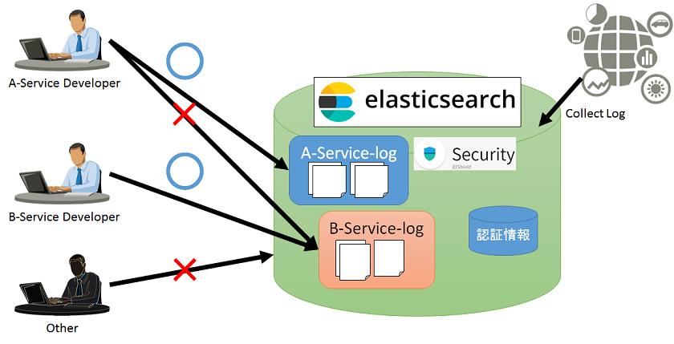
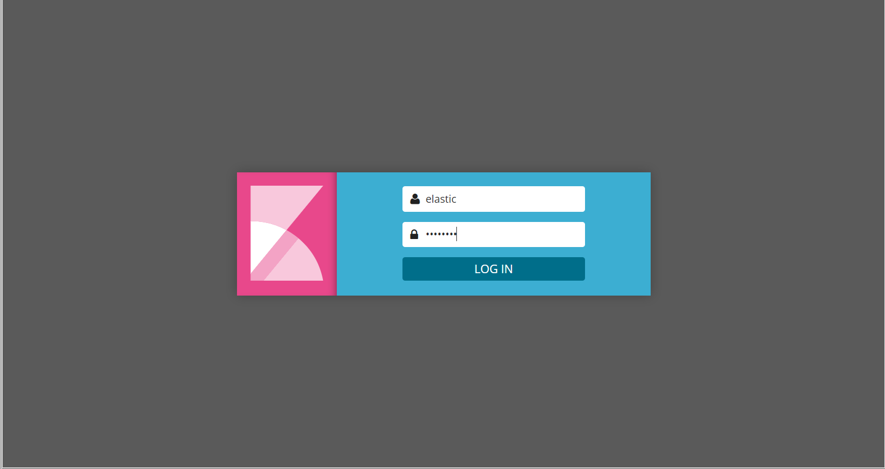
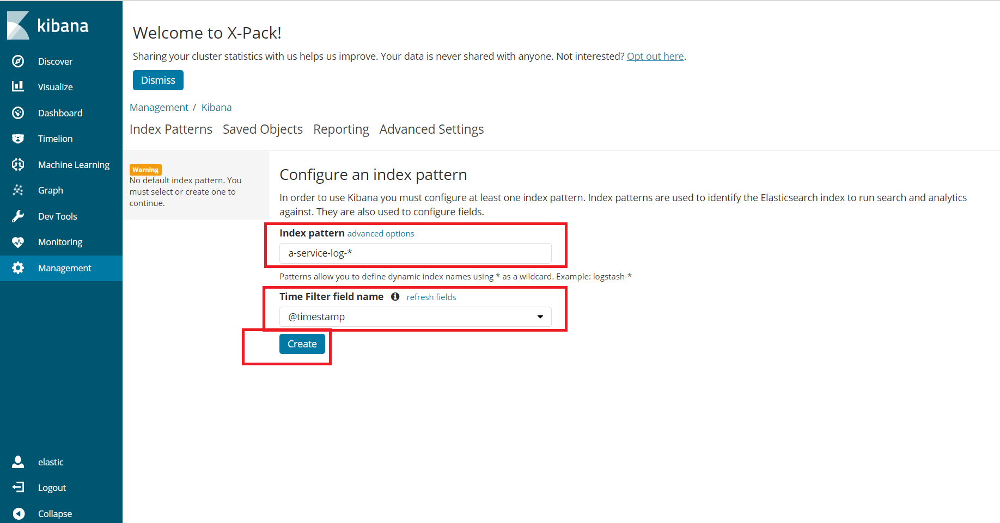
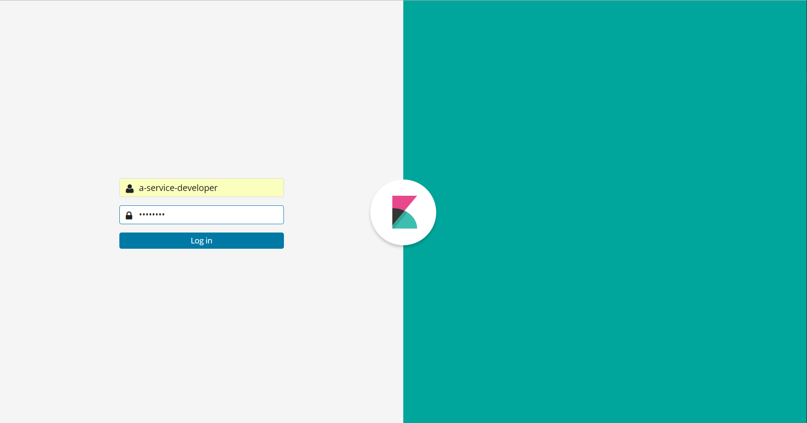
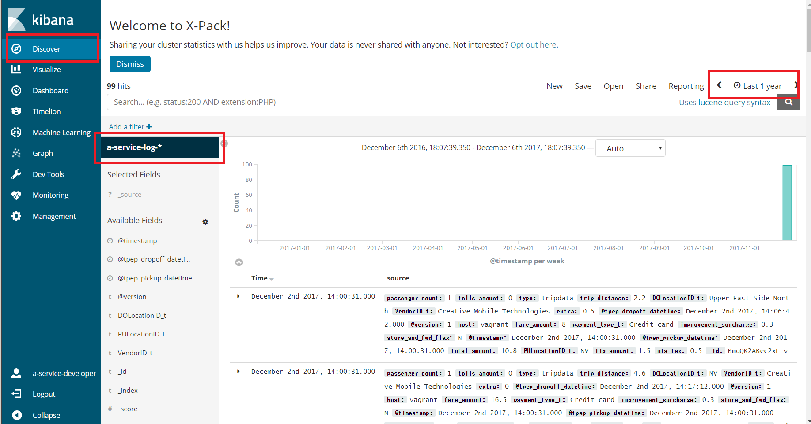
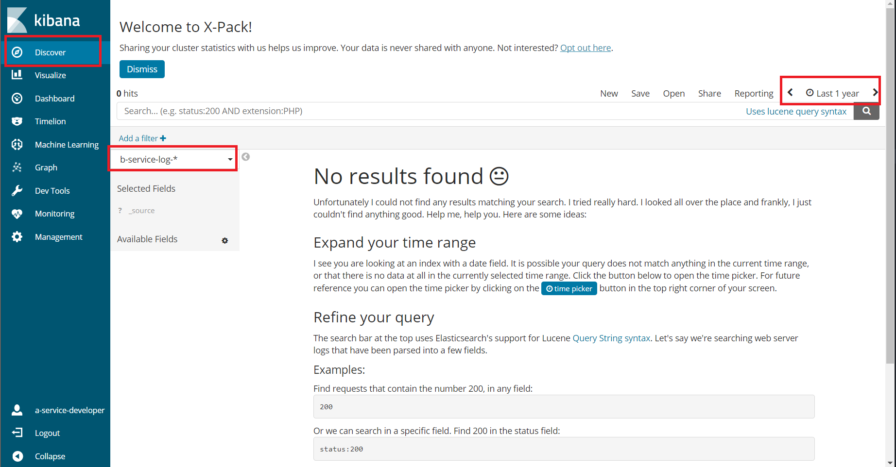

# Security demo


### 概要  
ロールベースのアクセス制御機能のデモ  



1. ユーザを複数用意(`a-service-developer`, `b-service-developer`, `other`)
1. インデックスを複数用意(`a-service-log`, `b-service-log`)
1. ログをindexとして収集しelasticsearchに格納  
   indexは`a-service-log-*`, `b-Service-log-*`
1. `a-service-developer`はa-service-log のみしか見れない設定を実施
1. `b-service-developer`はb-service-log のみしか見れない設定を実施
1. `a-service-developer`はa-service-log のみしか見れないことを確認
1. `b-service-developer`はb-service-log のみしか見れないことを確認
1. `other`は何も見れないことを確認

## Usage

### Setupします
* 以下を実行します
   ```
   vagrant up
   vagrant ssh

   bash /vagrant/demo/security/insert_demo_data.sh
   bash /vagrant/demo/security/create_demo_user.sh
   ```

* [Kibana](http://127.0.0.1:15601)にアクセスします  

* loginは `elastic/changeme` となります  


* ① index patternを**2つ作成**します  
  パターン名は`a-service-log-*`と`b-service-log-*`
* ② Time Filter field nameはいずれも`@timestamp`を指定します  
* ③ Createを押下します


* kibanaからlogoutします

### アクセス制御を確認します

* [Kibana](http://127.0.0.1:15601)に`a-service-developer`ユーザでログインします  
  passwordは`changeme`です


* `Discovery`で以下を入力し、グラフが表示されることを確認します  
  * ① Index : `a-service-log-*`
  * ② 時間範囲 : `Last 1 year`
  

* `Discovery`で以下を入力し、グラフが表示されないことを確認します  
  * ① Index : `b-service-log-*`
  * ② 時間範囲 : `Last 1 year`


* `b-service-developer`ユーザでは`b-service-log-*` Indexのデータが見え、`a-service-log-*`Indexのデータが見えないことを確認します  
**※ b-service-developerユーザもログインpasswordは`changeme`です**

* `other`ユーザでは`a-service-log-*` Indexのデータも、`b-service-log-*`Indexのデータも見えないことを確認します  
**※ otherユーザもログインpasswordは`changeme`です**

以上
